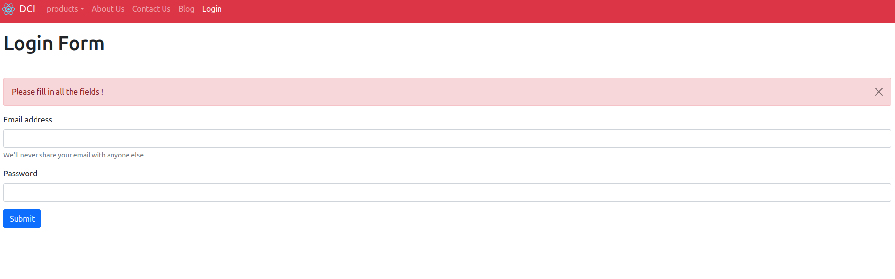

# React Context Api with useReducer

  

here we have the worked code of  the Notification system,we will update the code by refactoring it to use `useReducer()` to manage state, rather than `useState()`.


  

**Note:** There is no problem with using `useState`() in an small app like this. This exercise is intended as an opportunity to practice using `useReducer()` in a more "real-world" context. :-)

  

### Instructions

  

1. Open `NotificationsState.js`.

  

2. Replace your `useState()` state variables with a state **array**, created using `useReducer()`.

  ```js
  const [state , dispatch ] =  useReducer(reducer , []) 

  ```

**Note:** You need to import useReducer first

  

3. Replace all the `useState()` functions to update the old state variables with **dispatch** calls which use your new reducer to update the state array.

  
4. create the reducer function to update the state according  to the action.type value
> for the function `addNotification` you will need to add type as "ADD" and for the function removeNotification you will use "REMOVE" as a type for the action object. the payload for the "ADD" function is the object and the payload for "REMOVE" function is the id of the object.
```js 
dispatch({ type :"ADD" , payload : { msg , id ,type}})
```


 
  

Now try to run the project and see if it works the same way as before. In case you get any errors, make sure to read them carefully, as they will tell you where there is a problem so you can bug fix it. :-)